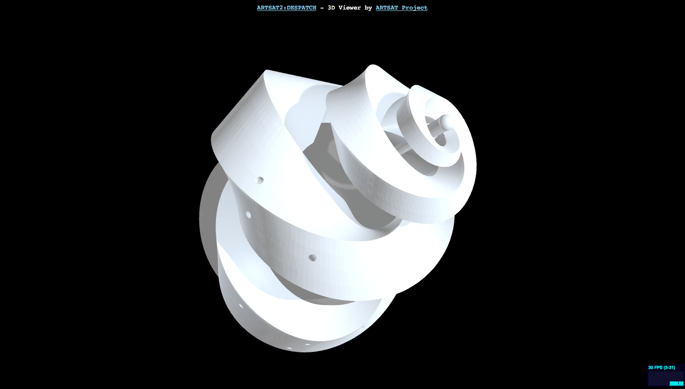

Despatch 3D-viewer
====
A 3D viewer for DESPATCH micro space-probe with Three.js.

## Description

With this repository, you can view [DESPATCH](http://artsat.jp/en/project/despatch), a micro space-probe developed by [ARTSAT project](http://artsat.jp), from your browser. 
You can zoom-in/out and rotate the spacecraft with mouse.

## Demo

http://motokimura.github.io/despatch-3d/

## Screenshot

## Requirements

A browser which supports WebGL (Google Chrome is recommended).

## License

[MIT License](LICENSE.txt)

## Team

[Motoki Kimura](https://github.com/motokimura)

[ARTSAT Project](https://github.com/ARTSAT)
